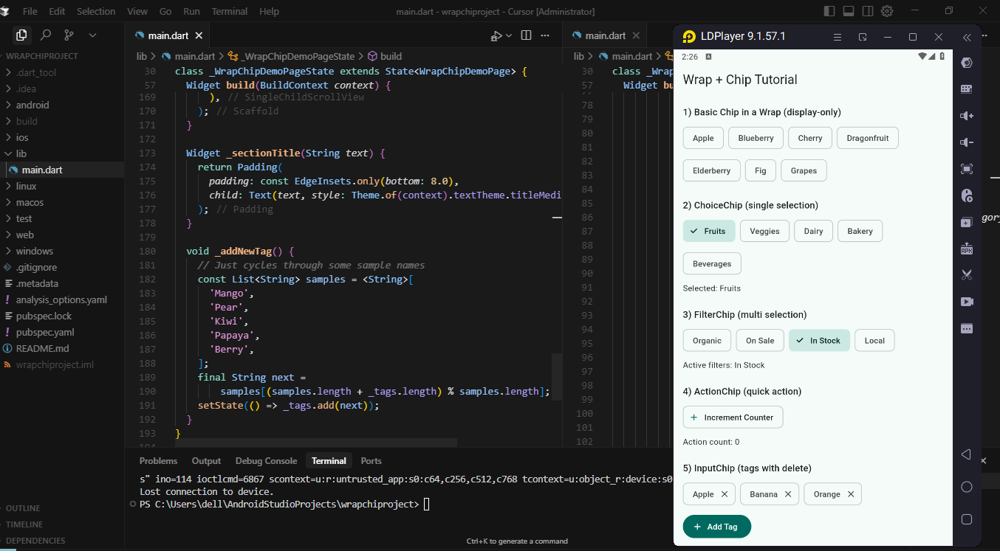
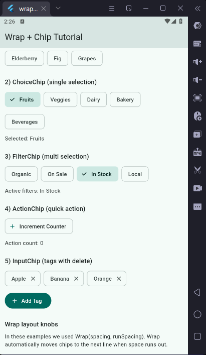
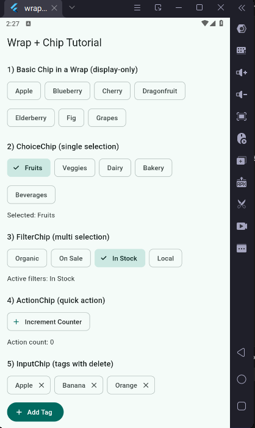

# wrapchiproject

This repo demonstrates Flutter `Wrap` and `Chip` widgets with practical, explainable examples.

### What is `Wrap`?
`Wrap` is a layout widget that positions its children horizontally or vertically and automatically moves overflowing children to the next run (line or column). Think of it as a flexible, responsive flow layout.

- **Common use cases**: Tags, filters, small buttons, compact items that need to wrap on small screens.
- **Key properties**:
  - `direction`: Axis.horizontal (default) or Axis.vertical
  - `spacing`: Space between children within the same run
  - `runSpacing`: Space between runs (lines)
  - `alignment`: How children are placed on the main axis within a run
  - `runAlignment`: How each run is placed on the cross axis
  - `clipBehavior`: How (if) children are clipped

Example:
```dart
Wrap(
  spacing: 8,
  runSpacing: 8,
  alignment: WrapAlignment.start,
  children: const [
    Chip(label: Text('Apple')),
    Chip(label: Text('Banana')),
    Chip(label: Text('Orange')),
  ],
)
```

### What is a `Chip`?
`Chip` displays a compact element: text, optional avatar/icon, and optional delete/action affordances. Chips are great for representing attributes, tags, user input, or actions.

Flutter provides several chip variants:
- **Chip**: Basic, display-only.
- **InputChip**: For user-entered items; supports selection, deletion.
- **ChoiceChip**: Single-selection among options (like radio buttons).
- **FilterChip**: Multi-selection among options (like checkboxes).
- **ActionChip**: Triggers an action when tapped.

Key properties (vary by type):
- `label`, `avatar`, `deleteIcon`, `onDeleted`
- `selected`, `onSelected`
- `pressElevation`, `backgroundColor`, `selectedColor`, `shape`

### When to use which chip
- **Display-only** info: `Chip`
- **Single choice** from a set: `ChoiceChip`
- **Multiple filters**: `FilterChip`
- **User-entered tokens** (e.g., email recipients, tags): `InputChip`
- **Lightweight action**: `ActionChip`

### Demo included in this repo
Open `lib/main.dart` to see:
- A `Wrap` that lays out many chips with `spacing` and `runSpacing`.
- `ChoiceChip` for one active category.
- `FilterChip` for toggling multiple filters.
- `ActionChip` for performing a quick action.
- `InputChip` for tags with delete handling.

Run the app:
```bash
flutter run
```

### Screenshots
Here's what the app looks like when running:



*Main demo showing all chip types in action*



*Detailed view of chip interactions*



*Another view showing different states*

### Tips for explaining this in an interview/class
- **Start with layout**: `Wrap` vs. `Row`/`Column` — `Wrap` auto-flows items to the next line.
- **Then chips**: Purpose of each chip variant and common UX patterns.
- **Point out state**: `ChoiceChip` uses single selection; `FilterChip` uses a set.
- **Customization**: Show how `selectedColor`, `avatar`, and `onDeleted` change behavior/appearance.

### More Flutter resources
- [Lab: Write your first Flutter app](https://docs.flutter.dev/get-started/codelab)
- [Cookbook: Useful Flutter samples](https://docs.flutter.dev/cookbook)
- [Flutter documentation](https://docs.flutter.dev/)


